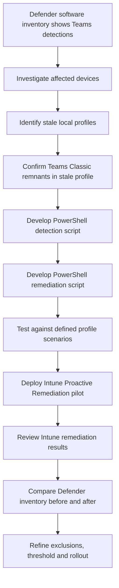

# Stale User Profile Detection and Legacy Microsoft Teams Remediation

> **Project Proposal**  
> Employer: **University of Huddersfield**  
> Technology stack: **Microsoft Intune**, **Microsoft Defender for Endpoint**, **PowerShell**, **Win32_UserProfile**, **Intune Proactive Remediations**

---

## Overview

Microsoft Defender for Endpoint identified a high number of Microsoft Teams-related software detections across the managed Windows estate. Some devices appeared to report multiple Teams versions at the same time, creating uncertainty around whether these entries represented:

- Active software
- Legacy application remnants
- Stale registry data
- Old installer references
- Per-user Teams installations
- Delayed Defender inventory
- Stale local user profile content

Initial investigation confirmed that the issue was more complex than a simple Teams version cleanup. A confirmed test case found an old local user profile, unused since 2023, that still contained a full Microsoft Teams Classic per-user installation of approximately **488 MB**. Teams Classic could still be launched from that profile.

As a result, the project has moved from a Teams-specific cleanup task into a wider endpoint hygiene project focused on detecting and safely removing stale local Windows profiles from appropriate managed laptops.

---

## Project Aim

The project aims to deliver a safe, repeatable and reportable **Intune Proactive Remediation** solution that detects and removes stale local Windows user profiles from managed University laptops.

The expected outcomes are:

- Cleaner endpoint state
- Reduced legacy per-user application remnants
- Improved Defender software inventory quality
- Better visibility of remaining exceptions
- Reduced manual investigation effort
- Safer remote remediation for managed laptops

---

## Problem Statement

Stale local profiles on managed laptops can retain old application binaries, cached data and historic per-user software. Microsoft Defender for Endpoint may continue to report these components even when the current user is using the approved modern Teams client.

This creates several operational and security issues:

| Issue | Impact |
|---|---|
| Defender software inventory becomes harder to interpret | Support and security teams may waste time investigating old detections |
| Old Teams versions appear to remain present | Devices may look non-compliant even when the active user is using modern Teams |
| Legacy per-user applications remain on devices | Unsupported binaries and cached data can remain longer than necessary |
| Unused local profiles consume disk space | Devices may lose storage capacity over time |
| Manual investigation is not scalable | Device-by-device cleanup is inefficient across the laptop estate |

The evidence indicates that stale profile remediation is a better corrective action than a narrow Teams-only cleanup.

---

## Proposed Solution

The solution will use **Microsoft Intune Proactive Remediations** with two PowerShell scripts:

| Script | Purpose |
|---|---|
| `Detect-StaleProfiles.ps1` | Detects stale local Windows profiles that meet the agreed remediation criteria |
| `Remediate-StaleProfiles.ps1` | Removes eligible stale profiles using supported Windows profile management methods |

The remediation will use `Win32_UserProfile` and `Remove-CimInstance`, rather than directly deleting folders from `C:\Users`.

---

## High-Level Workflow



---

## Technical Approach

### Detection Script

The detection script will run as **SYSTEM** in **64-bit PowerShell**.

It will query local profiles using `Win32_UserProfile` and assess each profile against agreed eligibility rules.

The detection logic will check:

- Profile path
- SID
- Loaded status
- Special profile status
- Last-use evidence
- Profile age
- Protected profile names
- Agreed exclusion rules

The script will return:

| Exit Code | Meaning |
|---|---|
| `0` | No stale profiles found |
| `1` | One or more stale profiles found and remediation is required |

This allows Intune Proactive Remediations to trigger the remediation script only where required.

---

### Remediation Script

The remediation script will use the same eligibility rules as the detection script. This keeps detection and remediation aligned and reduces the risk of inconsistent behaviour.

Eligible profiles will be removed using:

```powershell
Remove-CimInstance
```

against:

```powershell
Win32_UserProfile
```

The remediation output will record which profiles were:

- Removed
- Skipped
- Failed
- Not safe to determine

Failed or uncertain removals will remain visible for follow-up rather than being hidden.

---

## Protection and Exclusion Rules

The remediation will skip profiles that are:

- Loaded
- Active
- Special Windows profiles
- Administrator profiles
- Provisioning profiles
- Enrolment profiles
- Local support profiles
- Agreed protected profiles
- Not safely eligible for remediation

The remediation will **not** remove:

- The current approved Microsoft Teams client
- The Teams Meeting Add-in, unless separately approved
- Active or loaded user profiles
- Shared, lab or specialist device profiles during the initial rollout

---

## Scope

### In Scope

This project covers Intune-managed University Windows laptops where the device is intended for single-user assignment and stale local profiles can be safely remediated.

The project will use:

- Microsoft Defender for Endpoint software inventory
- Microsoft Intune Proactive Remediations
- PowerShell
- `Win32_UserProfile`
- `Remove-CimInstance`
- Intune remediation reporting
- Before-and-after Defender comparison
- Source control and testing evidence

The initial proposed stale profile threshold is **90 days**. A **60-day** threshold may be considered later if testing, risk review and service agreement support the change.

### Out of Scope

The initial rollout will exclude:

- Shared lab devices
- Student classroom devices
- Specialist multi-user devices
- Devices with different profile retention requirements
- Direct deletion of `C:\Users` folders as the primary remediation method

These device types should only be considered after separate review and approval.

---

## Development and Delivery Approach

The project will follow an iterative delivery model.

### 1. Investigation

Evidence will be gathered from:

- Defender software inventory
- Affected-device investigation
- Teams Classic remnants inside stale local profiles
- Local profile age and usage evidence

### 2. Script Development

The PowerShell scripts will be version-controlled and developed through small, traceable changes.

Code quality will be supported through:

- Clear structure
- Comments
- Predictable exit codes
- Error handling
- Logging
- Validation checks
- Safe exclusion logic

Where practical, the project will use:

- `PSScriptAnalyzer`
- `Pester`
- Structured test evidence

### 3. Testing

Testing will be completed before wider deployment.

The test matrix will include:

| Scenario | Expected Result |
|---|---|
| Device with no stale profiles | Detection exits `0`; no remediation |
| Device with one stale profile | Detection exits `1`; eligible profile removed |
| Device with multiple stale profiles | All eligible profiles identified and processed |
| Device with a loaded profile | Loaded profile is skipped |
| Device with protected administrator/support profile | Protected profile is skipped |
| Device with Teams Classic remnants in stale profile | Stale profile is detected and removed if eligible |
| Device where remediation should be skipped | Script reports skipped state safely |
| Device where removal fails | Failure is logged and remains visible |

### 4. Pilot Deployment

The remediation will be deployed to a small pilot group through Intune Proactive Remediations.

Pilot results will be reviewed before any wider deployment.

### 5. Wider Rollout

The wider rollout will remain controlled and limited to appropriate managed laptop device groups.

### 6. Monitoring and Refinement

Monitoring will use:

- Intune detection output
- Intune remediation output
- Defender software inventory
- Exception lists
- Before-and-after comparison
- Lessons learned

Scripts and exclusions will be refined where evidence shows changes are needed.

---

## Success Criteria

The project will be successful when the following outcomes are demonstrated:

- Stale local profiles can be detected reliably on managed laptops
- Active, loaded and protected profiles are excluded from remediation
- Eligible stale profiles can be removed safely using supported Windows methods
- The remediation can be deployed through Intune without requiring users to bring laptops to campus
- Intune reporting shows detection, remediation, success, failure and exception outcomes
- Defender software inventory can be compared before and after remediation
- Legacy Teams Classic or older Teams-related detections reduce where stale profile removal was the cause
- Failed, skipped or uncertain devices remain visible for review
- Source control, testing, deployment, monitoring, data security and operational ownership are evidenced
- Final documentation is clear enough for future support, review and maintenance

---

## Business and Service Value

### Security Value

The project reduces old per-user application remnants and cached profile data on managed laptops. It also reduces the chance that unsupported or outdated application binaries remain present on devices unnecessarily.

### Support Value

The project improves the quality of Defender software inventory. Fewer stale detections should reduce confusion around whether old Teams versions are actively installed and make remaining exceptions easier to investigate.

### Operational Value

The solution replaces manual device-by-device investigation with a repeatable Intune-delivered remediation. Remote laptops can be remediated without users needing to attend campus or support teams handling every device individually.

### User Value

The remediation is designed to be silent and controlled. The active user profile is protected, reducing disruption to normal laptop use.

### Digital Workspace Value

The project uses monitoring, automation, controlled deployment and evidence-led improvement to reduce hidden endpoint drift.

---

## Risks and Controls

| Risk | Control |
|---|---|
| Active user profile is removed accidentally | Loaded and active profiles will be excluded. Eligibility logic will be tested before wider deployment. |
| Administrator, support or provisioning profile is removed | Protected profile names and known support profiles will be explicitly excluded. |
| Shared, lab or specialist device is remediated incorrectly | Initial deployment will target appropriate laptop groups only. Shared and specialist device groups will be excluded. |
| Defender inventory does not update immediately | Before-and-after reporting will be interpreted over time rather than expecting instant inventory change. |
| Profile folder is deleted incorrectly | Remediation will use `Win32_UserProfile` and `Remove-CimInstance` rather than direct `C:\Users` folder deletion. |
| Stale profile detection is too aggressive | The initial stale threshold will be conservative, with 90 days proposed for production use. Any move to 60 days will require review. |
| Script output exposes unnecessary user data | Output will be limited to operationally useful remediation evidence and will avoid unnecessary personal data. |
| CI/CD evidence is too light | The project will use source control, version history, validation checks, testing evidence and staged Intune deployment as a lightweight release workflow. |
| Remaining detections are misinterpreted | Remaining Defender entries will be reviewed as exceptions and may represent current Teams, inventory delay or other Teams components. |

---

## Evidence Plan

The project will produce evidence across investigation, development, deployment and monitoring.

Evidence will include:

- Project brief and scope
- Defender baseline software inventory
- Affected-device investigation notes
- Evidence of Teams Classic inside a stale local profile
- PowerShell detection script
- PowerShell remediation script
- Git repository and commit history
- Script version history
- Change log
- `PSScriptAnalyzer` output
- `Pester` tests or structured test evidence
- Test matrix and results
- Intune Proactive Remediation configuration
- Pilot deployment results
- Detection and remediation output
- Before-and-after Defender comparison
- Exception list
- Lessons learned
- Final KSB mapping

This evidence will show how the work moved from investigation through to tested code, controlled deployment, monitoring and refinement.

---

## Assessment Coverage

The project provides evidence across the main BCS DevOps Engineer project areas.

| Area | Evidence |
|---|---|
| Code quality | PowerShell development, source control, versioning, code checks, testing, comments, error handling and safe remediation logic |
| Meeting user needs | User stories, acceptance criteria, silent deployment, active profile protection, reduced manual support and improved security visibility |
| CI/CD | Source-controlled scripts, validation, testing, pilot deployment and staged Intune rollout |
| Refreshing and patching | Endpoint state improvement, removal of stale profile data, reduction of legacy application remnants and cleaner managed endpoint baseline |
| Operability | Intune remediation reporting, Defender inventory comparison, logging, exception handling and monitoring |
| Data persistence | Local Windows profile state, Defender inventory records, Intune remediation records and retained logs or evidence outputs |
| Automation | PowerShell and Intune Proactive Remediations replacing manual investigation and cleanup |
| Data security | Stale profile risk reduction, protected-profile exclusions, controlled deployment, limited logging and safe removal methods |

---

## Suggested Repository Structure

```text
.
├── README.md
├── scripts/
│   ├── Detect-StaleProfiles.ps1
│   └── Remediate-StaleProfiles.ps1
├── tests/
│   ├── Pester/
│   └── Test-Matrix.md
├── evidence/
│   ├── defender-baseline/
│   ├── intune-remediation-output/
│   ├── pilot-results/
│   └── before-after-comparison/
├── docs/
│   ├── Project-Brief.md
│   ├── Rollout-Plan.md
│   ├── Risk-Assessment.md
│   └── KSB-Mapping.md
└── CHANGELOG.md
```

---

## Next Steps

The next stage is to finalise the project sign-off position with the tutor and confirm that the proposed scope is suitable for the work-based project.

Practical delivery steps:

1. Confirm the final stale profile threshold for pilot and production use.
2. Confirm the pilot device group and excluded device groups.
3. Finalise the detection and remediation scripts.
4. Store the scripts in source control with clear version history.
5. Complete the test matrix and capture results.
6. Deploy to a controlled Intune pilot group.
7. Review Intune detection and remediation output.
8. Compare Defender Teams-related detections before and after remediation.
9. Refine exclusions or script logic where evidence shows this is needed.
10. Complete the final project report and KSB mapping.

---

## Conclusion

This project is suitable as a Level 4 DevOps Engineer work-based project because it includes real investigation, coding, testing, automation, controlled deployment, monitoring and improvement.

The strongest evidence is the way the work changed direction after testing challenged the original assumption. Defender initially appeared to show a Teams version problem. Local investigation showed that stale user profiles could retain full legacy Teams Classic installations. The remediation approach was therefore adjusted to address the wider endpoint hygiene issue rather than only removing Teams-specific artefacts.

The project demonstrates a practical DevOps engineering cycle:


---

## Status

**Current stage:** Project proposal and planning  
**Deployment model:** Controlled Intune Proactive Remediation pilot followed by staged rollout  
**Primary focus:** Stale local profile detection and safe remediation  
